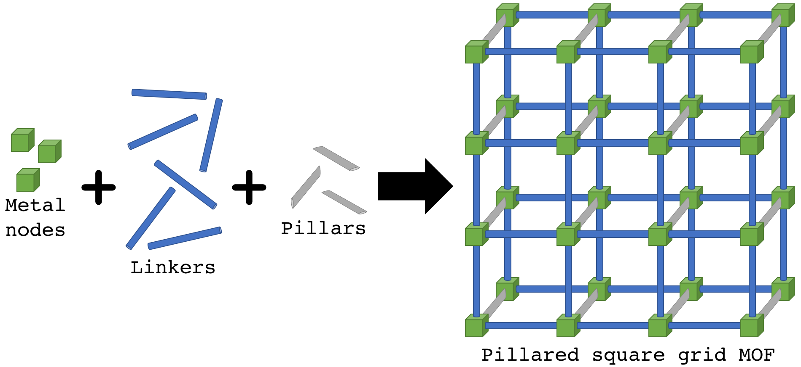
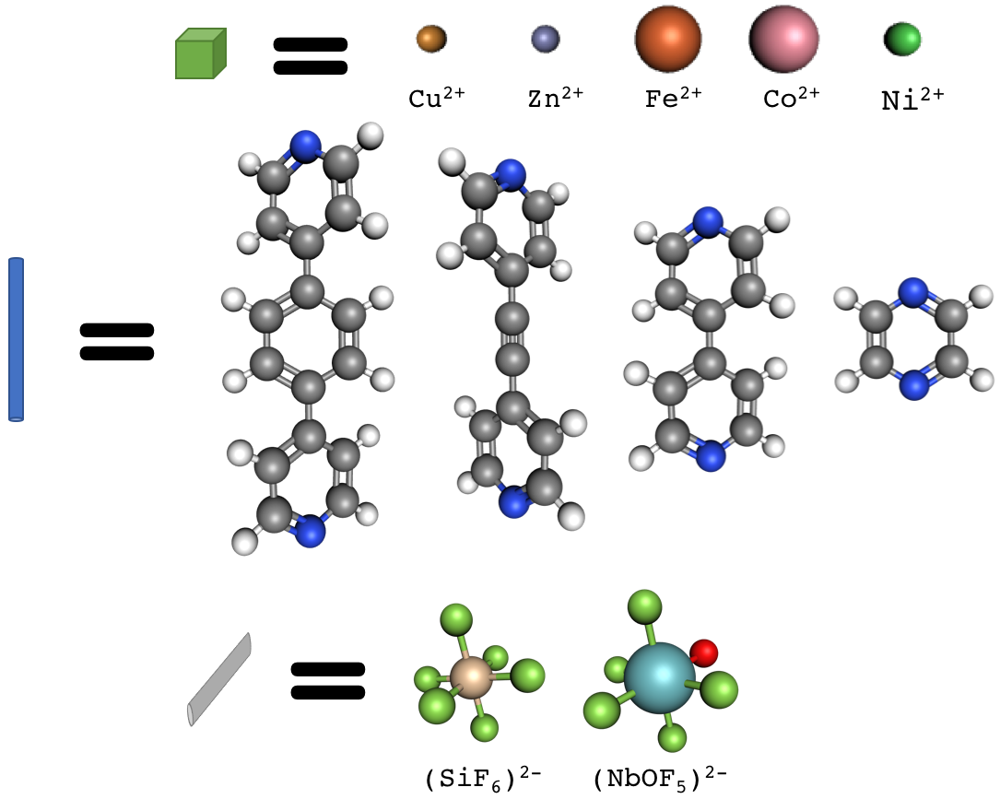
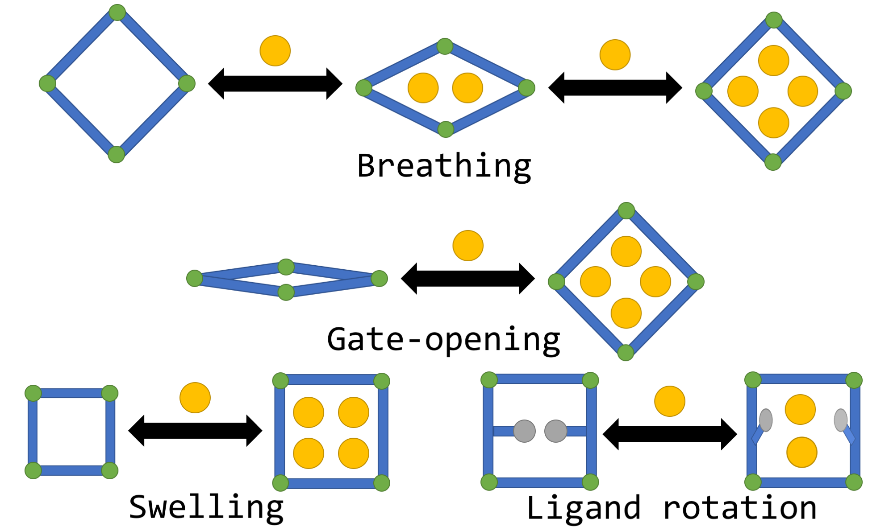

The Simon Research Ensemble resides in the School of Chemical, Biological, and Environmental Engineering ([CBEE](http://cbee.oregonstate.edu/)) at [Oregon State University](http://oregonstate.edu/). 
We leverage machine learning, statistical mechanics, and molecular simulations to accelerate the discovery and deployment of nano-porous materials for gas storage, separations, and sensing.
By collaborating with experimentalists, our efforts directly contribute to the development of novel materials and technologies, generation of cheaper and cleaner energy, and enhancement of national security.

<figure>
	

	
	

</figure>

# Research topics

### Nano-porous materials

Metal-organic frameworks (MOFs) are crystalline materials that possess nano-sized pores. The enormous internal surface areas and permanent porosity of MOFs afford them adsorption-based applications in storing, separating, and sensing gases. For example, MOFs can densify hydrogen gas for onboard vehicular fuel storage, selectively capture radioactive gases emitted during the reprocessing of used nuclear fuel, and detect toxic vapors or explosives as sensors.

An exciting aspect of MOFs is their modular and versatile chemistry. In the synthesis of MOFs, metal nodes/clusters and organic linker molecules self-assemble in solution to construct a porous framework. 

<figure>
	

	
	<figcaption>The molecular building blocks of a pillared square grid MOF are metal ions, linkers, and pillars.</figcaption>
	

</figure>

By changing the metal nodes and linker molecules, *many* different MOFs can be synthesized to exhibit diverse pore geometries and surface chemistries. Tens of thousands of different MOFs have been synthesized to date.

<figure>
	

	
	<figcaption>Pillared square grid MOFs have been synthesized with the shown metal ions, linkers, and pillars.</figcaption>
	

</figure>

This high chemical tunability allows chemists to fine-tune MOF architectures to target specific molecules for applications in gas storage, separations, and sensing. More broadly, this versatile and modular chemistry enables the synthesis of MOFs with diverse properties and functionalities.

An arm of our research is to employ molecular models and simulations to (i) sift through the many variations of MOFs and predict the top performing materials for a given application, (ii) predict novel properties that may emerge in flexible MOF paradigms, (iii) bring clarity to experimental observations, and (iv) identify means to exploit/harness unique adsorption properties in MOFs for engineering applications.

We aim to understand intimately and explain clearly.

#### Dynamic/flexible MOFs

Many MOFs are flexible and have moving parts that respond to external stimuli, which often give rise to unique and valuable properties. 

<figure>
	

	
	<figcaption>Examples of dynamic/flexible MOFs and their response to the adsorption of gas molecules (yellow balls). [Breathing] A large pore collapses upon the adsorption of gas. When more gas adsorbs, the pore opens again. [Gate-opening] Collapsed pores pop open and flood with gas molecules. [Swelling] The pore continuously swells as more gas adsorbs. [Ligand Rotation] Adsorbed gas molecules cause a swinging ligand to change its conformation.</figcaption>
	

</figure>

We are developing parsimonious but illuminating statistical mechanical models of dynamic/flexible MOFs to fundamentally understand how flexible/dynamic parts in MOFs respond to different stimuli and give rise to unique properties, such as negative thermal expansion. Such insights are valuable for optimizing the chemistry of flexible/dynamic MOFs for gas storage, gas separations, drug delivery, and chemical sensing. Ideally, our models will uncover new, unexpected ways to exploit dynamic/flexible MOFs for engineering applications.

We are also developing new algorithms to overcome challenges presented in the simulation of gas adsorption in flexible MOFs.

#### Bringing machine learning into materials science

Highly accurate molecular simulations/calculations often incur prohibitive computational costs, precluding *in-silico* high-throughput screening of MOFs with these high-level methods. A focus of our group is to leverage recent advances in deep learning and train neural networks to recognize optimal MOFs. Neural networks are attractive because they automatically discover features important for determining performance, negating the need for hand-engineered features. Bringing machine learning algorithms into materials science can expedite high-throughput computational screenings by focusing expensive but more accurate computations on only the most promising candidates.

#### Software development
Our group is developing `PorousMaterials.jl` (see [here](https://github.com/SimonEnsemble/PorousMaterials.jl)) to democratize the analysis of porous materials with user-friendly, free, open-source software written in Julia. [Julia](https://julialang.org/) is a relatively new, high-level programming language designed especially for numerical computing. Julia's just-in-time compiler and expressive syntax allows us to write code with speed approaching that of the C language but with much less effort and complexity. Furthermore, writing parallel code in Julia is seamless. 

An advantage of having our own, well-designed code that we know well is that we can easily modify it to enable new and custom types of molecular simulations for our research. We hope that other groups will join in the development and use of `PorousMaterials.jl`.

### Deciphering the code for transcriptional gene regulation

Gene regulation is the process by which cells orchestrate the synthesis of proteins and RNA molecules for which their genome encodes. An intimate understanding of how genes are regulated in human will enable cures for genetic disorders, effective treatments for cancers, and increases in human longevity. However, much remains to be understood about basic regulatory elements in the human genome, such as promoters, insulators, silencers, and enhancers, and how they dictate the level of expression of a given gene. Several high-throughput assays have been developed to interrogate the activity of regulatory DNA sequences. An arm of our research, in collaboration with Wouter Meuleman at [Altius Institute for Biomedical Sciences](http://www.altius.org/), is to employ deep learning algorithms (e.g. ConvNets) to learn from large and noisy gene expression data sets how regulatory instructions are encoded into our genome. We aim to design interpretable deep learning architectures to extract useful biological insights from gene expression data sets.

<figure>
	

	
	<figcaption>A DNA promoter sequence recruits transcription factors that bind to DNA in a sequence-specific manner to recruit RNA polymerase II and initiate transcription of a gene.</figcaption>
	

</figure>

### Self-organizing vegetation in arid landscapes

In the thirsty grasslands of Namibia, the landscape is covered by thousands of small, barren disks called fairy circles.

<figure>
	

	
	<figcaption>Small, barren disks called fairy circles persist in the grasslands of Namibia.</figcaption>
	

</figure>

Tune into the BBC documentary, *Africa* (S1: E1, at 3:00) [on Netflix] to listen to David Attenborough introduce fairy circles in his captivating narration. 

Fairy circles may at first appear to have little relevance in a research program in chemical engineering. To the contrary, the etiology of these striking patterns can be explained by the principles of fluid flow, the theory of phase transitions, and multiple-scale analysis. Our group is developing a mathematical model to capture the formation and persistence of these fairy circles and understand the influence of climate on the pattern. Our efforts are towards understanding and monitoring how ecological systems cope with climate stresses and, perhaps, revealing new strategies to intensify agricultural crop production in arid climates.

## The value of mathematical modeling

> Science is what we understand well enough to explain to a computer. Art is everything else we do. :microphone: Donald Knuth

We use mathematics and computer simulations to shed light on physical phenomena. The formalism of mathematics allows for a clear conceptualization of the phenomenon at hand. Mathematical models can reduce dauntingly complex physical processes to their core ingredients [[Ringrose and Howard](https://doi.org/10.1016/j.coisb.2017.02.003)]. Modeling is a means to identify underlying structure in the physical world and, from an engineering perspective, elucidate how to manipulate/harness/exploit physics to benefit humanity.

> If people do not believe that mathematics is simple, it is only because they do not realize how complicated life is. :microphone: John von Neumann

Great satisfaction can be found in expressing how something works in a mathematical framework. The insights that follow are often rich, unexpected, and beautiful.

> To those who do not know mathematics, it is difficult to get across a real feeling as to the beauty, the deepest beauty, of nature. :microphone: Richard Feynman

We frequently approach poorly understood problems with parsimonious, but illuminating models.

> Make things as simple as possible, but not simpler. :microphone: Albert Einstein

> Now it would be very remarkable if any system existing in the real world could be exactly represented by any simple model. However, cunningly chosen parsimonious models often do provide remarkably useful approximations. For example, the law PV = RT relating pressure P, volume V and temperature T of an ideal gas via a constant R is not exactly true for any real gas, but it frequently provides a useful approximation and furthermore its structure is informative since it springs from a physical view of the behavior of gas molecules. For such a model there is no need to ask the question “Is the model true?”. If “truth” is to be the “whole truth” the answer must be “No”. The only question of interest is “Is the model illuminating and useful?”. :microphone: George Box

For processes where the physics are well-understood, we employ _predictive_ models, where we attempt to model as much of the physics as the accuracies of current models permit. One might argue that the development of predictive models has the most lucid impact; imagine if a molecular model were so accurate that we could design the optimal nano-porous material for hydrogen storage on a computer. However, rarely are molecular models so accurate, and typically the most accurate models are computationally infeasible. Still, predictive models are often capable of capturing qualitative differences between materials, generating statistically reliable performance rankings of a set of materials, or elucidating trends/design rules.
